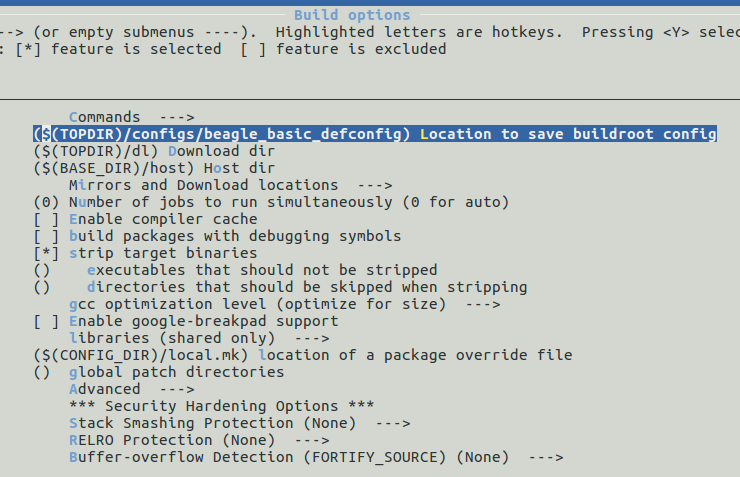

# Buildroot Örnek: RootFS Overlay Özelliği

SSH bağlantısı için Dropbear paketini eklememiz tek başına yeterli olmadı, komut satırından kartımıza sabit bir IP adresi de vermemiz gerekti. Ancak sistemi yeniden başlattığımızda kartımıza verdiğimiz IP adresi kaybolacaktır. Her açılışta kartımızın sabit bir IP ile başlamasını istiyorsak `/etc/network/interfaces` dosyasına müdahale etmemiz gerekmektedir. 

Sistemimizde bulunan vi editorü ile interfaces dosyasına aşağıdaki satırları ekleyelim.(vi denen eziyet ile tanışmadan olmaz!) 

~~~
auto eth0
iface eth0 inet static
	address 192.168.2.100
	netmask 255.255.255.0
~~~

Dosyayı kaydedelim ve kartı yeniden başlatalım. Kartımız tekrar ayağa kalktığında `/etc/network/interfaces` içinde belirttiğimiz 192.168.2.100 IP adresini otomatik alarak başlayacaktır. İşlemleri kontrol etmek için SSH bağlantısını tekrar kurabilirsiniz.

Ancak bu durum yeni bir sorunu ortaya çıkarmaktadır. Üreteceğimiz her cihaza tek tek müdahale etmemiz gerekmektedir. 

Buildroot'ta yaptığımız rootfs derlemesinin içerisine belirlediğimiz dosyaları kopyalayan bir mekanizma vardır: `rootfs overlay` 

Buildroot'ta overlay yapabilmemiz için menüden bir klasörü göstereceğiz. Bu klasör derleme sonrası olduğu gibi üretilen rootfs'in üzerine kopyalanır. Bu nedenle kopyalanmasını istediğimiz dosyalar rootfs'te bulunacağı klasör ağacında olmalıdır. 

Buildroot overlay klasörü gibi projeye özel dosya/klasörlerin `board` klasörü altında olmasını önerir. Bizde `board` klasörü altında kendimize bir klasör açalım. Mevcutta bulunan `board` altındaki diğer proje klasörlerini incelemenizi öneririm.

~~~
cd /opt/workspace/buildroot
mkdir board/beagle_edu
~~~

`beagle_edu` klasörü altında ileride başka dosyalarda bulunacaktır bu nedenle rootfs_overlay klasörünü oluşturup onun altında çalışacağız.

~~~
cd board/beagle_edu
mkdir rootfs_overlay
mkdir etc/
mkdir etc/network
nano etc/network/interfaces
~~~

Dosya içeriği şu şekildedir:

~~~
# interface file auto-generated by buildroot

auto lo
iface lo inet loopback

auto eth0
iface eth0 inet static
	address 192.168.2.100
	netmask 255.255.255.0
~~~

Overlay klasörünü buildroot'a tanıtalım: Derleme menüsünden `System Configuration` altındaki overlay bölümüne `board/beagle_edu/rootfs_overlay` yazalım.

Temiz bir build alalım. 
~~~
make clean
make
~~~

Derlemeyi hızlıca kontrol etmek için output klasörü altındaki target klasörüne bakabiliriz. Son olarak SD-Kartımıza yeni imajı yükleyelim ve kontrol edelim.

~~~
cat output/target/etc/network/interfaces
~~~

## Defconfig Dosyasının Kaydedilme Yerinin Ayarlanması

Bu ana kadar yaptığımız örneklerde defconfig dosyasını `make savedefconfig` komutu ile buildroot ana klasörü içine kaydediliyor ve elle `config` klasörü altına taşınıyordu. Linux ve U-Boot'ta bu hedef dosya değiştirilemezken Buildroot'ta değiştirilebilir. 

Buildroot menüsünde `Build options` altında bulunan config dosyasının kaydedileceği yer `$(TOPDIR)/configs/beagle_basic_defconfig` olarak ayarlanır.

Bundan sonra yapacağımız kaydetmeler belirttiğimiz dosyanın içerisine olacaktır.

Son yaptığımız değişiklikleri de kaydedelim ve bu bölümü sonlandıralım.

~~~
make savedefconfig
cat configs/beagle_basic_defconfig
~~~

