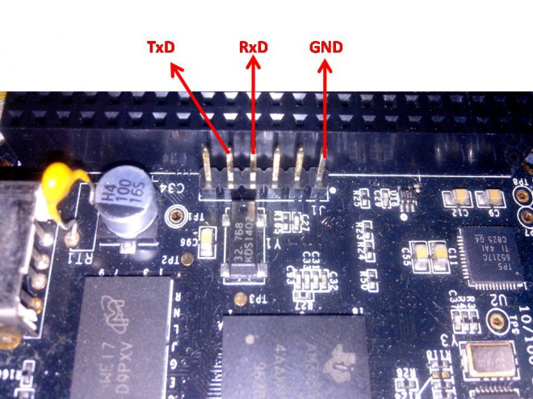

# BBB için UART Konsol Bağlantısı

BBB UART0 portundan gelecek olan verileri izlemek için bir adet USB-TTL UART çevirici ve `picocom` programını kullanacağız. Programın kurulumu ve kullanıcının `dialout` grubuna katılması (bu sayede her picocom başlangıcında sudo yazmaktan kurtulacağız) için gereken komutlar şu şekildedir. 

~~~
sudo apt install picocom
sudo adduser $USER dialout
~~~

Host makina restart edilir. `picocom` kullanmak ise oldukça basittir
~~~
picocom -b 115200 /dev/ttyUSB0
~~~

picocom'dan çıkmak için `CTRL+C` kullanılmalıdır.

USB-TTL UART çeviriciyi karta aşağıdaki şekilde bağlayacağız.

