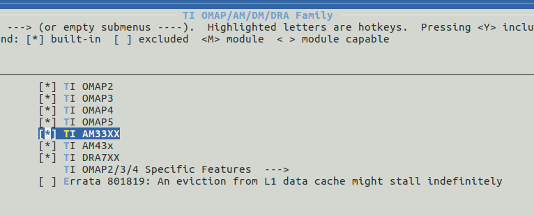
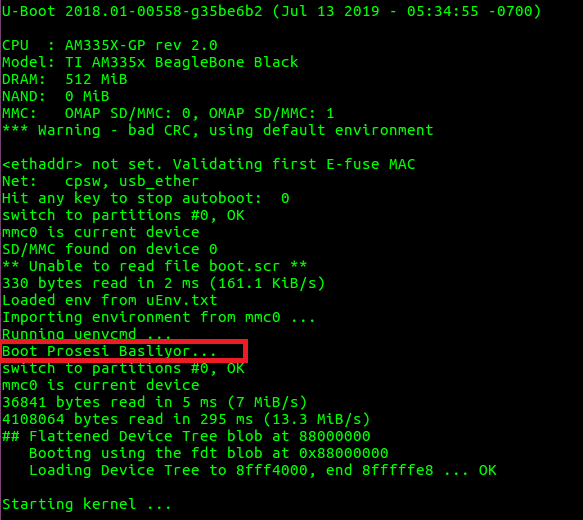

# Kernel Derleme

## Kernel Edinme

U-Boot'ta olduğu gibi kernel içinde iki adet temel kaynağımız vardır: Mainline(ana akım) kernel ve TI kernel. U-Boot konusunda olduğu gibi ben TI'nin sağladığı Linux kerneli kullanacağım. 

Mainline kernel kernel.org websitesinden indirilebilir. 

Kernel.org'dan git kullanarak indirmek için şu komut kullanılır:
~~~
git clone git://git.kernel.org/pub/scm/linux/kernel/git/stable/linux-stable.git
~~~

Git kullanmadan `tarball` olarak indirmek için https://kernel.org/pub/linux/kernel websitesinden istenilen versiyon indirilebilir.

TI kernel indirmek için iki yol vardır:

1. TI Processor SDK (Toolchain kurma bölümünde anlatıldı) 
2. git.ti.com 'dan indirme

TI GIT üzerinden indirerek işlemlerimizi yapalım.

~~~~
cd /opt/workspace
git clone git://git.ti.com/ti-linux-kernel/ti-linux-kernel.git linux
cd linux/
~~~~

GIT ile indirdiğimiz için birçok branch bulunacaktır. Önce branchlere bakalım 
~~~
git branch -a
~~~

Biz çalışmalarımızı **Processor SDK 5.03'e** paralellik göstermesi için **ti-linux-4.14.y** branch ile yapalım.

~~~
git checkout ti-linux-4.14.y
~~~

Bu noktada işlerin karışmaması için kendi branchimizi oluşturmamız gerekiyor. Branch ismi **beagle_dev** olsun. 

~~~
git checkout -b beagle_dev
~~~

Yaptığımız kontrol edelim.

~~~
git status
~~~

>On branch beagle_dev
>nothing to commit, working directory clean

Artık Linux üzerinde yapacağımız tüm değişiklikler git tarafından takip edilecek.

## Kernel Derleme

U-Boot'ta olduğu gibi derleme için bize bir adet çalışan `config` dosyası lazım. ARM sistemler için `config` dosyaları Linux içerisinde `arch/arm/configs/` altında bulunur. Bu klasörün içinde çeşitli kartlar için `config` dosyaları bulunmaktadır, aşağıdaki komut ile mevcut config dosyaları listelenir. 

~~~
ls /opt/workspace/linux/arch/arm/configs
~~~

BBB kartlar için `omap2plus_defconfig` dosyası kullanılacaktır. İndirdiğimiz SDK içerisinde ayrıca config dosyaları da var ancak şimdilik `omap2plus_defconfig` ile ilerleyelim.

`omap2plus_defconfig` dosyası aynı zamanda bazı DTS dosyalarını da derleyecektir. Bize lazım olan am335x-boneblack.dts dosyasıdır ve `omap2plus_defconfig` kapsamında derlenmektedir. Hangi dosyaların derleneceğinin belirlenmesi, kendi DTS dosyamızı sisteme tanıtmak gibi konulara ileride değerlendireceğiz. Device Tree dosyaları `arch/arm/boot/dts` klasörü altındadır, aşağıdaki komut ile mevcut DTS dosyaları listelenir.

~~~
ls /opt/workspace/linux/arch/arm/boot/dts
~~~

Şimdi `omap2plus_defconfig` dosyasına göre derleme yapalım.

~~~
cd /opt/workspace/linux
make ARCH=arm omap2plus_defconfig
~~~

Isterseniz şu aşamada menuconfig ile konfigürasyona bakabilirsiniz. İşlemci seçiminin doğru olduğunu görmek için menüden System Type / TI OMAP/AM/DM/DRA Family altındaki seçeneklere bakabilirsiniz.

~~~
make ARCH=arm menuconfig
~~~

Derleme yapalım. İlk yapacağımız derleme de `-j` ile parametre vermeden tek çekirdek ile derleme yapmak daha iyi olacaktır. Bu sayede hata ayıklama işi daha kolay olmaktadır.

~~~~
export CC=/opt/workspace/sdk/gcc-linaro-7.3.1-2018.05-x86_64_arm-linux-gnueabihf/bin/arm-linux-gnueabihf-
make ARCH=arm CROSS_COMPILE=$CC -j4
~~~~

Toolchain olarak Linaro'dan indirdiğimiz toolchain'i kullandık ve `CROSS_COMPILE=$CC` ile toolchain'i bildiriyoruz. 

`ARCH=arm` parametresi ile derlememizi ARM çekirdek ile yapacağımızı bildiriyoruz.

`-j4` parametresi ile derleme için kaç çekirdek kullanılacağını bildiriyoruz. Eğer ilk defa derleme yapıyorsanız bu parametreyi kullanmayın. Bu sayede derleme hatalarını görmemiz daha kolay olacaktır.

Derlememiz başarılı ise derlenmiş kernel **zImage** `arch/arm/boot` klasörü altında, **am335x-boneblack.dtb** dosyası `arch/arm/boot/dts` klasörü altında olacaktır.

Hazırladığımız SD-Karta bu iki dosyayı kopyalayalım. U-Boot başladığında ise herhangi bir tuşa basarak konsoldan durduralım.

U-Boot konsoldan aşağıdaki komutları girelim.

~~~~
mmc rescan  
mmc dev 0  
setenv kerneladdr 0x82000000  
setenv dtbaddr 0x88000000  
fatload mmc 0:1 ${dtbaddr} am335x-boneblack.dtb  
fatload mmc 0:1 ${kerneladdr} zImage
setenv bootargs console=ttyO0,115200n8 root=/dev/mmcblk0p1 rw rootfstype=ext4 rootwait   
bootz ${kerneladdr} - ${dtbaddr}
~~~~

Yukarıdaki komutlara baktığımızda MMC cihazdan *setenv* tanımladığımız `kerneladdr` ve `dtbaddr` RAM adreslerine sırasıyla kernel ve device tree dosyası yüklenir. `bootargs` U-Boot ortamı için özel bir değişkendir, kernele boot esnasında verilecek parametreleri tutar. Verdiğimiz parametreler sırasıyla kernel konsolunun 115200 8n1 formatında ttyO0 (UART0) olacağı, rootfs'in /dev/mmcblk0p1 altında ext4 formatında ve yazılabilir olduğunu bildiriyoruz. En son satırda bootz komutuyla `kerneladdr` ve `dtbaddr` RAM adreslerinden makinanın boot prosesini başlatıyoruz.

Bu aşamada kernel boot işlemi başlayacak ancak rootfs olmadığı için işlem yarım kalacaktır.Eğer buraya kadar sorunsuz geldiysek işler gayet iyi gitmiş demektir.

Tabii her boot işleminde komutları tekrar tekrar girmeyeceğiz, bu komutları uEnv.txt dosyasında saklayacağız. 

Örnek uEnv.txt dosyasını [buradan](../uEnv.txt) indirebilirsiniz. Yaptığımız basitçe; yukarıda yazmış olduğumuz komutları özel bir U-Boot ortam değişkeni olan `uenvcmd` içine kaydetmek. U-Boot bu değişkeni yürüteceği için sırasıyla bizim komutları script gibi çalıştıracak. Tabii rootfs olmadığı için "Kernel panic" mesajıyla boot prosesi bitecek. 

Bu aşamadan sonra ilk rootfs'mizi oluşturalım ve bir adet sistemi tamamlayalım.
