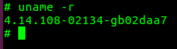
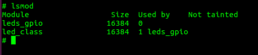

# Kernel Örnekler

## Örnek: Kernel Modül Kullanımı

*Not: Bu örneği yürütebilmeniz için RootFS'in oluşturulmuş ve SSH üzerinden bağlanmanız gereklidir.*

Kernel modülleri isteğe bağlı olarak çalışma durumunda yüklenip/çıkartılabilen kod parçalarıdır. Bu sayede sistemi yeniden başlatma gereği olmadan sistemin işlevselliği artırılabilir ([kaynak](https://wiki.archlinux.org/index.php/Kernel_module)).  

Kernel konfigürasyonunda bir girdinin yanında `M` yazıyorsa bu girdi modül olarak derlenecek demektir. Örnek olarak kernel derlemede kullandığımız `omap2plus_defconfig` içerisinde **435** (!) kernel modülü vardır. Konfigürasyon dosyanın içerisine bakmanızı tavsiye ederim.

Kernel modüllerini derleyelim:

~~~
export CC=/opt/workspace/sdk/gcc-linaro-7.3.1-2018.05-x86_64_arm-linux-gnueabihf/bin/arm-linux-gnueabihf-
cd /opt/workspace/linux
make ARCH=arm CROSS_COMPILE=$CC -j4 modules_install INSTALL_MOD_PATH=out
~~~

Yukarıdaki komutlar sonrasında modüller *out* klasörüne kopyalanacaktır.

Kernel modülleri RootFS içerisinde `/lib/modules/kernel_release` içerisinde bulunurlar. *kernel_release* değişkendir bu sayede kernel kendisine ait modülleri yükler(Bu durum sahadaki cihazın kernelini güncellediğinizde modüllerin yüklenmemesi sorununa da yol açabilir). Mevcut kernelin dağıtım ismini `uname -r` komutu ile öğrenebiliriz.

 

Modülleri oluşturduğumuz out klasörünün içerisindeki klasör ağacı /lib/modules/4.14.108-02134-gb02daa7/ şeklindedir. Tüm bu modülleri sistemimize kopyalayalım.

~~~
cd out/lib/
tar cf modules.tar *
scp modules.tar root@192.168.2.100:/lib/
~~~

Kopyaladığımız modules.tar dosyasını boardda açalım.

~~~
cd /lib/
tar xf modules.tar
sync
~~~

Modülleri yüklemek için iki adet komut vardır: `insmod` ve `modprobe`. insmod ile modül dosyasının tam yolunu vermeniz gerekir. modprobe komutu ise `/lib/modules/$(uname -r)/modules.dep.bin` dosyasından modülleri okur ve eğer modüle ve bağlı olduğu modüller varsa onları yükler, kısaca insmod'dan daha yetenekli bir komuttur. 

Burada dikkat edilmesi gereken modprobe, kernel versiyonu ile birebir aynı isimdeki klasörün altındaki modüllere bakar. 4.14.79-gvea klasörü altındaki modüller kernel 4.14.79-aabbcc tarafından modprobe ile **yüklenemeyecektir.**

Board'a kopyaladığımız modülleri listelemek için aşağıdaki komut koşturulur.

~~~
modprobe -l
~~~

Board üstünde `leds-gpio.ko` modülünü yükleyelim.
 
~~~
modprobe leds-gpio
~~~

Modülü yükleyince ethernet konnektörü tarafındaki LEDlerden D4'ün seyrek olarak yanmaya başladığını görebiliriz. 

`lsmod` ile yüklenmiş olan modüllere bakalım.

Görüldüğü üzere biz `leds-gpio.ko` modülünü yükleme komutunu vermiştik ancak modprobe bu modülün ihtiyaç duyduğu `led_class` modülünü de yüklemiştir.

Son olarak ek bir modül daha yükleyelim. 

~~~
modprobe ledtrig-heartbeat
~~~

`ledtrig-heartbeat` modülünü yüklediğimizde ise D2 LEDinin de yanmaya başladığını göreceksiniz. Heartbeat LEDi Linux çekirdeğinin çalıştığını gösteren bir modüldür.

Son olarak `ledtrig-heartbeat` modülünü kaldıralım ve D2 LEDini kapalı konuma alalım.

~~~
modprobe -r ledtrig-heartbeat
~~~
