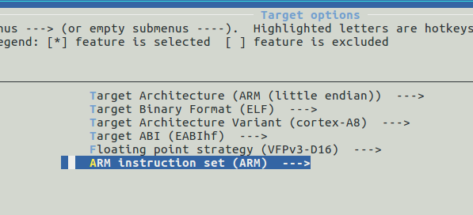
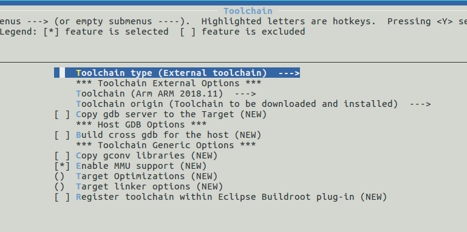
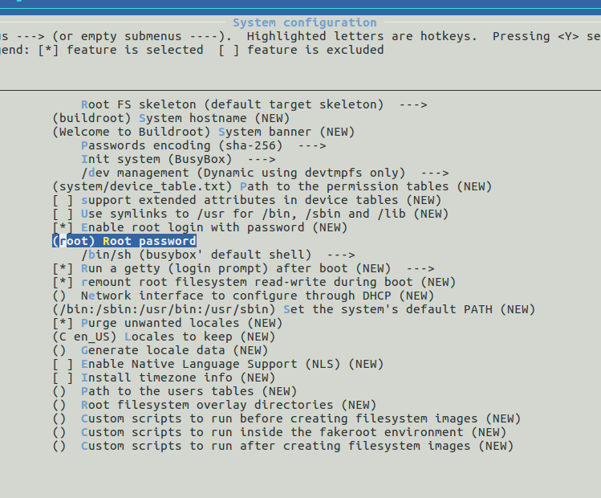
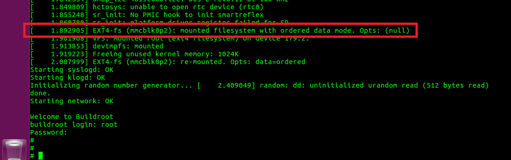

# Buildroot Giriş

## Buildroot Edinme

Buildroot'un **2019.02** versiyonunu kullanacağız. Bunun için ya GIT ile indirip kendi branchimizi yada direk olarak **2019.02** paketini (tarball) indireceğiz. Bu kitapta buildroot için tarball üzerinden yürüyeceğiz. 

GIT
~~~
cd /opt/workspace
git clone git://git.busybox.net/buildroot
cd buildroot
git checkout -b beagle_dev 2019.02
~~~
TARBALL
~~~
cd /opt/workspace
wget https://buildroot.org/downloads/buildroot-2019.02.5.tar.bz2
tar xf buildroot-2019.02.5.tar.bz2
mv buildroot-2019.02.5 buildroot
cd buildroot
~~~

## Buildroot ile Basit Bir RootFS Oluşturma

Buildroot içerisinde kernel ve u-boot'ta olduğu gibi hazır defconfig dosyaları bulunmkatadır. Kullandığımız Beaglebone-Black içinde hazır bir config dosyası (beaglebone_defconfig) vardır ancak Buildroot ile sıfırdan başlamak kolay olduğu için biz hazır gelen defconfig yerine kendi config dosyamızı oluşturacağız.

Öncelikle basit bir konfigürasyon yapalım:

~~~
cd buildroot
make menuconfig
~~~

`Target Options` bölümünden 
* Mimariyi **ARM (little endian)**
* Mimariyi varyantını **cortex-A8**

olarak seçelim. Bu verileri AM335x datasheetinden elde ettik.

Bir üst menüye dönelim ve `Toolchain` bölümünden
* Toolchain tipini **External Toolchain** 

olarak seçelim. Harici toolchain olarak Linaro 2018.11 toolchain kullanılıyor. buildroot'un kendi toolchaini ben hiç kullanmadım ve oldukça zaman aldığı kaynaklarda söyleniyor.

Bir üst menüye dönelim ve `System configuration` bölümünden
* Root şifresini **root** 

olarak ayarlayalım.

Ana menüde görebileceğiniz üzere **Kernel** ve **Bootloader** bölümleri adlarından da kolayca anlaşılacağı gibi Buildroot aracılığı ile kernel ve u-boot derlemek için kullanılırlar.

**Target packages** bölümü sistem üzerindeki varolacak paketleri belirlemede kullanılır. Buildroot içinde yaklaşık olarak 2500 paket bulunmaktadır. Bu menü içerisinde gezmenizi tavsiye ederim.

Son olarak ana menüden `Filesystem images` bölümüne göz atalım. Bu menüde oluşturacağımız RootFS'in tipini belirliyoruz. Şuan sizde sistem tar formatında çıktı üretecektir.

Peki şimdi kaydedip çıkalım ve ilk derlememizi alalım.

~~~
make
~~~

Ekranda bir süre Buildroot'un yaptığı işlemler kayacak ve en sonunda ilk RootFS imajımız oluşacak.

Buildroot'un oluşturduğu çıktılar `output/images` klasörü altındadır. Şuan için sadece **rootfs.tar** bu klasörün altında olmalıdır.

~~~
ls output/images/
~~~

SD-Kartımızı takalım ve oluşturduğumuz RootFS imajını atalım. 

~~~
sudo tar xvf output/images/rootfs.tar -C /media/$USER/rootfs
sync
~~~

Kartı boot ettiğimiz zaman U-Boot kerneli yükleyecek, kernel ise rootfs'e bağlanarak login aşamasına gelecektir.

Tebrikler :) İlk defa tüm parçaları ile bir Gömülü Linux Sistemini oluşturdunuz.

Şimdi Buildroot'ta hazırladığımız config dosyasını kaydedelim.

~~~
make savedefconfig
mv defconfig configs/beagle_basic_defconfig
~~~