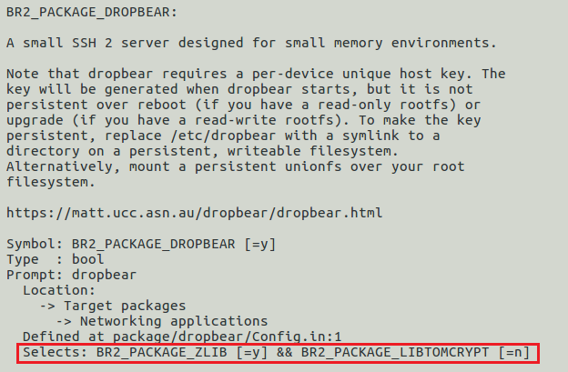
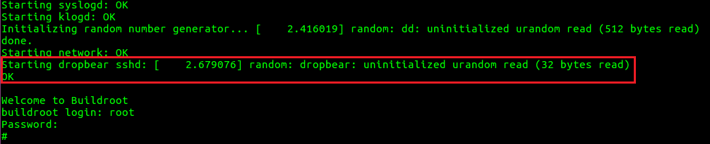
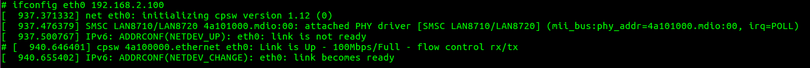
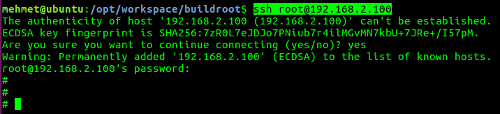

# Buildroot Örnek: SSH Server Eklemek

İlk yaptığımız derlemeye kartımıza SSH bağlantısını sağlamak için gerekli olan Dropbear paketini ekleyelim.

~~~
cd /opt/workspace/buildroot
make menuconfig
~~~

`Target packages` / `Networking applications` bölümünden `dropbear` seçeneğini işaretleyip derleme yapalım.

Bu noktada dikkatinizi çekmenizi istediğim nokta `dropbear` paketinin ihtiyaç duyduğu paket otomatik olarak seçilir ve derleme sırasında bu ek paket(ler) kurulur. 

~~~
make
~~~

Yeni RootFS'i SD-Karta yükleyelim. Açılış loglarında dropbear'in başladığını göreceğiz.

PC ile Beaglebone-Black arasında ethernet kablosu ile bağlantı kuralım. Daha sonra PC ethernet portuna sabit bir IP (örn: 192.168.2.35) verelim (Windows'ta denetim masasından IP vermeniz sanal makina için yetiyor). Kartımıza da aynı subnette sabit bir IP vermemiz gerekiyor, komut satırından şu şekilde halledebiliriz:

~~~
ifconfig -a
ifconfig eth0 192.168.2.100
~~~

Bu durumda kartımızın **eth0** portunu sabit bir IP vererek ayağa kaldırdık. Yaptıklarımızı doğrulamak için sanal makinanın komut satırından karta ping atalım.

~~~
ping 192.168.2.100
~~~

Eğer tüm ayarlar doğru ise ekranda ping mesajlarını göreceksiniz. SSH bağlantısını *root* kullanıcı olarak kurmak için aşağıdaki komut bilgisayardan yürütülür. 

~~~
ssh root@192.168.2.100
~~~

İlk defa SSH bağlantısı kurulacağı için bilgisayarınız bu makinayı listeye eklemeyi size soracak, onaylamanız durumunda şifre bölümüne geçeceksiniz.

Böylelikle ilk defa Buildroot kullanarak yeni bir paket sisteminize eklemiş olduk. Son olarak config dosyamızı kaydedelim, ek olarak içine göz atalım. OPENSSL ve DROPBEAR paketleri de yeni config dosyamızda gözüküyor olmalı.

~~~
make savedefconfig
mv defconfig configs/beagle_basic_defconfig
cat configs/beagle_basic_defconfig
~~~
