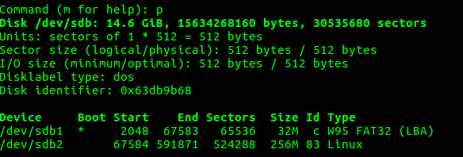

# SD-Kart Hazırlama

AM335x için sd-kartın belirli formatta hazırlanması gerekmektedir. AM335x RBL aşamasında sd-kartın içinde FAT bir bölüm arar ve buradan SPL dosyasını arar.

SPL Dosyası U-Boot'u, U-Boot Linux Kerneli yükleyecektir. Bu dosyaların hepsi FAT bölümde olacaktır.

RootFS ise sd-kart üzerinde başka bir bölümde (genellikle ext4 formatında) olacaktır.

Özetle FAT ve EXT4 formatında olan iki ayrı bölüm olacaktır, gereken adımlar şu şekildedir: 

SD-Kart takıldığı zaman Ubuntu tarafında hangi `/dev/` altında yeni bir cihaz olarak belirecektir. Bu isim genelde `sdb,sdc` gibi isimlerle ortaya çıkar. Yanlış bir isim ile işlem yaparsanız mevcut diskinizi uçurabilirsiniz.

Benim sistemimde sd-kart `/dev/sdb` olarak gözükmektedir.

Öncelikle sd-kartın mevcut MBR silinir.
~~~
sudo dd if=/dev/zero of=/dev/sdb bs=1M count=16
~~~
SD-Kart bölümlendirilmesi için `fdisk` kullanacağız. 
~~~
sudo fdisk /dev/sdb
~~~
1. `o` ile yeni bir DOS tablosu oluşturulur.
2. `n` ile yeni bir bölüm oluşturulur. Sırasıyla `p` , `1` seçilir. Başlangıç sektörünü değiştirmeyeceğimiz için `enter` ile kabul edilir. Bundan sonraki aşamada birinci bölümün boyutunu belirlemek için değer girilir, biz `+32M` girelim.  
3. Birinci bölümün tipini W95 FAT16 (LBA) yapmak için sırasıyla `t` ve `e` seçilir.
4. Birinci bölümün boot edilebilir flagini setlemek için `a` ve `1` seçilir.
5. RootFS için gerekli olan ikinci bölüm için `n` ile yeni bir bölüm oluşturulur. Sırasıyla `p` , `2` seçilir. Başlangıç sektörünü değiştirmeyeceğimiz için `enter` ile kabul edilir. Bundan sonraki aşamada ikinci bölümün boyutunu belirlemek için değer girilir, biz `+256M` girelim.
6. Son olarak yaptıklarımızı `p` ile kontrol edelim. Şöyle bir tablo görmemiz gereklidir.

7. `w` ile yaptığımız işler kaydedilir ve çıkılır.

Oluşturduğumuz SD-kart bölümlerine dosya sistemleri kurulur.
~~~
sudo mkfs.vfat /dev/sdb1 -n "boot"
sudo mkfs.ext4 /dev/sdb2 -L "rootfs"
~~~

