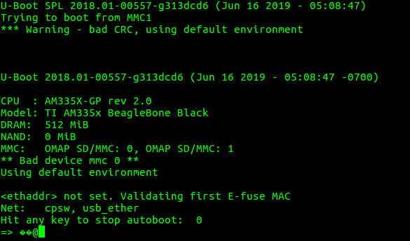

# U-Boot Derleme

## U-Boot Edinme

U-Boot indirmek için iki adet kaynağımız var. Denx veya BBB işlemcisinin üreticisi olan Texas Instruments (TI) websitelerinden. 

TI; tekrar etmeke gerekirse Processor SDK adı altında U-Boot ve Linux için kaynaklarından aldığı snapshotların üzerine kendi işlemcileri için ek geliştirmeler koyarak dağıtımını yapmaktadır. Esas hedefimiz **endüstriyel** olduğu için ben TI'nin sağladığı U-Boot ve Linux kaynak kodlarını kullanmayı tercih ediyorum. 

Biz yine de Denx'den indirmenin komutunu verelim.
~~~~
git clone git://git.denx.de/u-boot.git
~~~~

Peki TI'dan nasıl indireceğiz? Bunun için iki yol var. 

1. TI Processor SDK (Toolchain kurma bölümünde anlatıldı) 
2. git.ti.com 'dan indirme

TI GIT üzerinden indirerek işlemlerimizi yapalım.

~~~~
cd /opt/workspace
git clone git://git.ti.com/ti-u-boot/ti-u-boot.git uboot
cd uboot/
~~~~

GIT ile indirdiğimiz için birçok branch bulunacaktır. Önce branchlere bakalım 
~~~
git branch -a
~~~

Biz çalışmalarımızı **Processor SDK 5.03'e** paralellik göstermesi için **2018.01** branch ile yapalım.

~~~
git checkout ti-u-boot-2018.01
~~~

Bu noktada işlerin karışmaması için kendi branchimizi oluşturmamız gerekiyor. Branch ismi **beagle_dev** olsun. 

//TODO bu noktayı açıkla   

~~~
git checkout -b beagle_dev
~~~

Yaptığımız kontrol edelim.

~~~
git status
~~~

>On branch beagle_dev
>nothing to commit, working directory clean

Artık U-Boot üzerinde yapacağımız tüm değişiklikler git tarafından takip edilecek.

## U-Boot Derleme (Giriş Seviye)

Temelde Linux, U-Boot, Buildroot derlemek için en gerekli dosya **config** dosyasıdır. Eğer bir boarda ilk defa derleme yapıyorsanız başlangıç için çalışan bir `config` dosyası bulunmaz bir nimettir (özellikle Çin tabanlı işlemcilerle olan kartlarda)

`config` dosyaları U-Boot içerisinde `configs/` altında bulunur. Bu klasörün içinde bazı kartlar için `config` dosyaları bulunmaktadır. 

Eğer sizin kartınız ile ilgili `config` dosyası bulamazsanız internetten aramanız gerekiyor yada gözünüzün kestirdiği bir `config` ile şansınızı deneyebilirsiniz. 

~~~
ls /opt/workspace/uboot/configs
~~~

Biz derlememizi `am335x_evm_config` dosyası ile yapacağız.

~~~
cd /opt/workspace/uboot
make am335x_evm_config
~~~

Yukarıdaki komutu yürüttüğümüzde U-Boot `am335x_evm_config` dosyasına göre ayarlanır. Aslında yapılan işlem U-Boot ana klasöründe bulunan .config dosyasını güncellemektir. 

Kontrol edelim.

~~~
make menuconfig
~~~

Resimde görüldüğü üzere U-Boot 2018.01 versiyonda ve ARM çekirdek için derleme yapacak.

Peki bir derleme yapalım.

~~~~
export CC=/opt/workspace/sdk/gcc-linaro-7.3.1-2018.05-x86_64_arm-linux-gnueabihf/bin/arm-linux-gnueabihf-
make ARCH=arm CROSS_COMPILE=$CC -j4
~~~~

Toolchain olarak Linaro'dan indirdiğimiz toolchain'i kullandık ve `CROSS_COMPILE=$CC` ile toolchain'i bildiriyoruz. 

`ARCH=arm` parametresi ile derlememizi ARM çekirdek ile yapacağımızı bildiriyoruz.

`-j4` parametresi ile derleme için kaç çekirdek kullanılacağını bildiriyoruz. Eğer ilk defa derleme yapıyorsanız bu parametreyi kullanmayın. Bu sayede derleme hatalarını görmemiz daha kolay olacaktır.

Derlememiz başarılı ise çıktılar uboot klasörü altında olacaktır. Bizim işimize yarayacak dosyalar `MLO` ve `u-boot.img` dosyalarıdır. 

`MLO` Rom Bootloader tarafından çağrılacak olan SPL yani ön U-Boot yükleyicisidir. 

`u-boot.img` ise isminden de çıkarabileceğimiz üzere U-Boot'un kendisidir.

`MLO` ile `u-boot.img` dosyalarının boyutlarına bakmanızı tavsiye ederim.

[SD-Kartı hazırlama](sdcard_prepare) ile kartımızı hazırlayalım. `MLO` ve `u-boot.img` dosyalarını diskin `boot` bölümüne kopyalayalım. 

Eğer işleri doğru yürüttüysek U-Boot UART üzerinden bize mesajlar gönderecektir. SD-Kartı takalım, [UART konsol bağlantısını](uart_console_setup) yapalım ve picocom'dan verileri izleyelim. 

Eğer UART konsoldan mesajlar geliyorsa, herhangi bir tuş ile sistemin bootunu durduralım.  
Şöyle birşeyler görmemiz gerekiyor.

Mesajlarda görüldüğü üzere öncelikle SPL yükleniyor daha sonra U-Boot yüklenmekte.

Mesajlarda derleme tarih ve saati yazmaktadır. Özellikle geliştirme aşamasında işe yarar bir bilgi olabiliyor.

Eğer U-Boot'un otomatik boot prosesini durdurmamış olsaydık U-Boot dahili ortam değişkenlerine bağlı olarak çeşitli yerlerde (MMC0, SPI, Ethernet vs.) Linux çekirdeği arayacaktı, bulamayacağı için ekrana bir tomar mesaj basacaktı ve en sonunda kendi konsoluna düşecekti.

Bu aşamada yapmamız gereken son iş ise bir adet uEnv.txt hazırlamak ve onu kopyalamak.